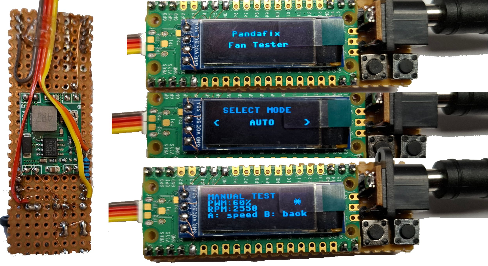

# 🌈✨ Pandafix Fan Tester ✨🌈

---

  
**A Raspberry Pi Pico PWM PC ventilátor tesztelő – OLED kijelzővel, animált menüvel, kétgombos vezérléssel!**

---

---

## 🇬🇧 **ENGLISH GUIDE**

---

### 🚀 Quick Start

#### 1️⃣ Flash the Firmware

1. **Hold** the <kbd>BOOTSEL</kbd> button on your Pico and plug it into USB.
2. The drive **RPI-RP2** will appear.
3. **Copy** `Pandafix-Fan-Tester.uf2` onto it.
4. The Pico will reboot, and your tester is ready to go! 🎉

---

#### 2️⃣ Hardware Wiring

| Function            | Pico GPIO | Connects to                  |  
|---------------------|-----------|------------------------------|
| PWM output          | GP16      | Fan PWM (blue wire)          |
| TACH input          | GP17      | Fan TACH (yellow wire) +1Kohm|
| Menu button (B)     | GP14      | Button to GND                |
| Select button (A)   | GP15      | Button to GND                |
| OLED SDA            | GP4       | OLED I2C SDA                 |
| OLED SCL            | GP5       | OLED I2C SCL                 |
| OLED VCC            | 3V3       | OLED Power                   |
| OLED GND            | GND       | OLED/Fan/Buttons GND         |

> ⚡ **The fan's 12V power must come from an external supply!**  
> Connect all GNDs together.

---

#### 3️⃣ Menu & Controls

- **Navigation:**
  - <kbd>B</kbd> (Menu): Cycle between `AUTO` and `MANUAL` in the main menu, or go back from a test mode.
  - <kbd>A</kbd> (Select): Enter the selected mode from the menu, or (in MANUAL) step the fan speed.

- **Modes:**
  - **AUTO:** Fan cycles through 10–100% PWM automatically, showing live RPM and a spinning icon.
  - **MANUAL:** Step fan speed with <kbd>A</kbd> (Select); see RPM and animation.
  - **Back:** Press <kbd>B</kbd> (Menu) to return to the main menu from any mode.

---

#### 4️⃣ What is Pandafix Fan Tester?

- 🛠️ **Tests any 4-pin PC PWM fan** (12V, standard pinout)
- 🎛️ **Animated fan icon** and live RPM on OLED
- 🕹️ **Easy menu navigation** with two buttons
- 🔁 **Auto and manual test modes**
- 🐍 **MicroPython-based, fully open source**

---

#### 5️⃣ MicroPython Source & Customization

- Full MicroPython source: `main.py`, `ssd1306.py`
- Upload with Thonny or any MicroPython IDE
- More info: [MicroPython.org](https://micropython.org/)

---

#### 6️⃣ About this project

> _This project was almost entirely created with AI, but it still needed a Droid’s helping hand (that’s me)!_

---

#### 7️⃣ License

MIT License – Free for any use.

---

---

# 🇭🇺 **MAGYAR ÚTMUTATÓ**

---

### 🚀 Gyors kezdés

#### 1️⃣ Firmware feltöltése

1. **Tartsd lenyomva** a <kbd>BOOTSEL</kbd> gombot, majd csatlakoztasd a Pico-t USB-re.
2. Megjelenik az **RPI-RP2** meghajtó.
3. **Másold rá** a `Pandafix-Fan-Tester.uf2` fájlt.
4. A Pico újraindul, a tesztelő azonnal indul! 🎉

---

#### 2️⃣ Hardver bekötés

| Funkció           | Pico GPIO | Csatlakozás                   |
|-------------------|-----------|-------------------------------|
| PWM kimenet       | GP16      | Ventilátor PWM (kék vezeték)  |
| TACH bemenet      | GP17      | Ventilátor TACH (sárga) +1Kohm|
| Menü gomb (B)     | GP14      | Gomb GND-re                   |
| Select gomb (A)   | GP15      | Gomb GND-re                   |
| OLED SDA          | GP4       | OLED I2C SDA                  |
| OLED SCL          | GP5       | OLED I2C SCL                  |
| OLED VCC          | 3V3       | OLED táp                      |
| OLED GND          | GND       | OLED/Venti/Gombok GND         |

> ⚡ **A ventilátor 12V tápját külső tápegységről add!**  
> A GND-ket mindenhol közösíteni kell.

---

#### 3️⃣ Menü és kezelés

- **Navigáció:**
  - <kbd>B</kbd> (Menü): Menüben léptetés (AUTO ↔ MANUAL), illetve visszalépés teszt módból.
  - <kbd>A</kbd> (Select): Belépés a kiválasztott módba, manuális módban sebességváltás.

- **Módok:**
  - **AUTO:** A ventilátor automatikusan végigmegy a 10–100% PWM tartományon, élő RPM kijelzéssel és animált ikonnal.
  - **MANUAL:** A Select gombbal léptethető a ventilátor sebessége, RPM és animáció is látható.
  - **Vissza:** Menü gombbal bármikor visszaléphetsz a főmenübe.

---

#### 4️⃣ Mire jó a Pandafix Fan Tester?

- 🛠️ **Bármilyen 4-pines PC ventilátor tesztelése** (12V, szabványos kiosztás)
- 🎛️ **Animált ventilátor ikon** és élő RPM OLED kijelzőn
- 🕹️ **Egyszerű menü két gombbal**
- 🔁 **Automata és manuális teszt mód**
- 🐍 **MicroPython alapú, teljesen nyílt forráskód**

---

#### 5️⃣ MicroPython forrás & testreszabás

- Teljes MicroPython forrás: `main.py`, `ssd1306.py`
- Töltsd fel Thonny-val vagy bármilyen MicroPython IDE-vel
- További infó: [MicroPython.org](https://micropython.org/)

---

#### 6️⃣ A projektről

> _Ez a projekt szinte teljes egészében mesterséges intelligencia segítségével készült, de kellett hozzá egy Droid is (vagyis én)!_

---

#### 7️⃣ Licenc

MIT License – Szabadon felhasználható, módosítható, terjeszthető.

---

✨🐼 Jó tesztelést kíván a Droid és az AI! 🐼✨

